# Godot SkyRoads

A port of **SkyRoads** (Bluemoon Interactive, 1993) to Godot 4 — rebuilt from
the original's own data and checked, frame by frame and tick by tick, against
a reference implementation of the DOS engine and against the retail
`SKYROADS.EXE` itself.

The aim was not "a game that plays like SkyRoads". It was a port whose
simulation agrees with the original on **every field of every tick**, and whose
screen agrees with it pixel for pixel wherever that is achievable.

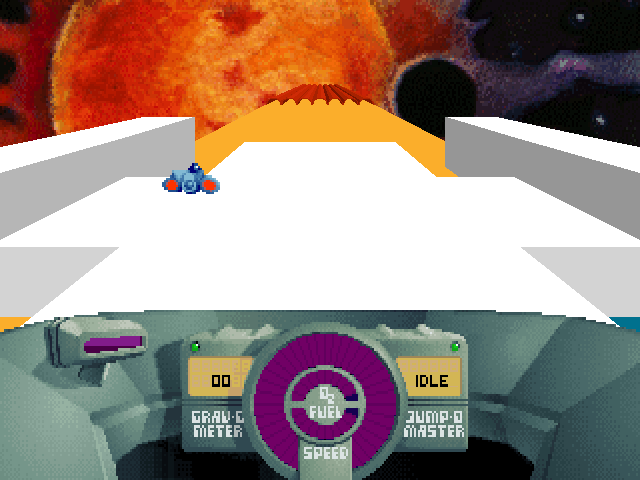

---

## How close is it?

Close enough that most comparisons are a diff of zero. The left half of each
image below is the DOS engine; the right half is this port, driven by the same
recorded input to the same tick.

**Road select — pixel-identical, 0 differing pixels of 64,000:**

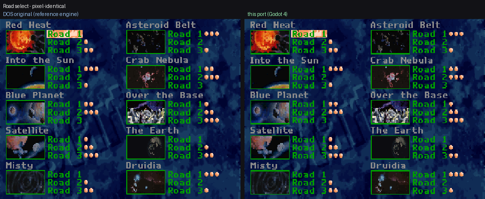

**Driving into a tunnel** — the arch profile is decoded from the original's
span tables, not modelled by eye:

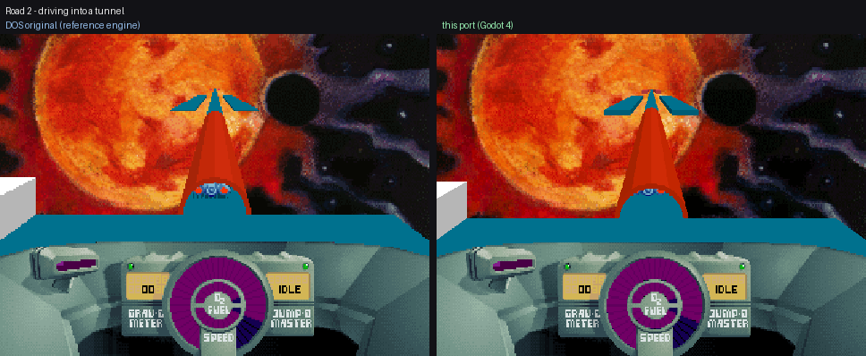

**A dark world** — the backdrop, its stars, and the road's shading:

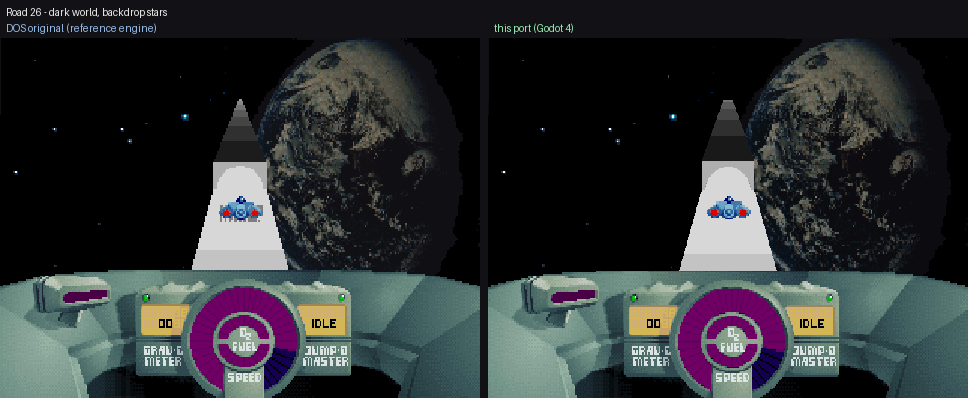

**A crash** — the explosion art is byte-identical to the original's sprite
cells, and the animation runs on the same counter:

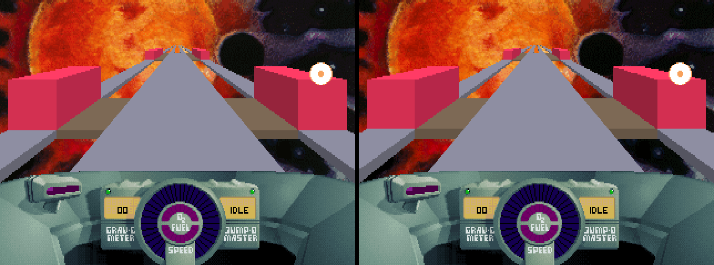

Measured parity, as of the last verification run:

| what | result |
|---|---|
| Simulation vs C and Python reference engines | **60,964 ticks, 24 fields, three engines, identical** |
| Dashboard band vs the DOS frame | **0 differing pixels** across a whole run |
| Menu screens (road select, settings, help) vs DOS | **0 differing pixels** |
| Backdrop vs its source art | **0 differing pixels** |
| Roads completed end to end, in the real scene | **23 of 30** — the other 7 have no solved route yet |
| Road geometry, RGB, rows 34..128 | **0.5% - 2.0%** of road pixels on roads 2, 5, 21 and 26 |
| Road geometry, from inside a tunnel | **6.4%** — the worst frame in the game, and what is left of it is named |

**Measure road parity in RGB, not palette indices.** Classifying to the
nearest palette entry counts differences nobody can see: road 26's greys sit
4/255 apart, and index comparison reported 33% where RGB reports 10%. See
[`docs/BUGS.md`](docs/BUGS.md) §12.8. Every figure above is RGB.

The road-geometry difference used to be five to twelve times larger, and what
closed it was measurement rather than a better camera. The original's vertical
projection is not one pinhole: the camera reproduces the DECK band edges to
0.24 px, and RAISED surfaces are drawn on a different ladder entirely — read
straight off the baked span tables, identical for half-height and full-height
blocks, and exactly 1:1 at the ship's own depth. Applying it as a vertex term
beside the horizontal cone that was already there took road 21 from 7.9% to
1.7% and road 5 from 8.4% to 2.0%. See [`docs/BUGS.md`](docs/BUGS.md) §12.18
and §12.19; §12.7 covers what is left, and four earlier attempts at moving the
camera are recorded there so they are not retried.

---

## Measured against the 1993 binary, not against a C port

The port was originally written against `skyroads-port/`, a C reimplementation.
That turned out to prove very little: **fourteen defects have now been found by
disassembling the retail `SKYROADS.EXE`, and every one of them was present in
the C reference too**, which is why no test could see them. The shell
(`BUGS.md` §11, eleven of them), the frame composer (§12.1), and the gameplay
song's no-repeat rule (§12.10).

So "matches the C reference" is not evidence here. The method that replaced it:

```python
# code image starts at (u16 at EXE offset 8) * 16; addresses in the RE notes
# are code-segment relative; the data segment is paragraph 0x66E
from capstone import Cs, CS_ARCH_X86, CS_MODE_16
```

plus `tools/dump_bands.c kindlines <slot>` for the span records a composer
consumes. Collision, the movement integrator, `in_tunnel`, surface effects,
both tank burn rates, the HUD's three formulas and the autopilot have all been
read this way and match (§12.6, §12.9); the attract demo and the road-end
screen have not.

The C reference is a measuring instrument, and where it was wrong it has been
corrected — those patches live in
[`docs/reference-corrections/`](docs/reference-corrections/), because
`skyroads-port/` and `analysis/` are sibling checkouts and not part of this
repository. **Apply them before trusting any parity number.**

---

## The game

| | |
|---|---|
| 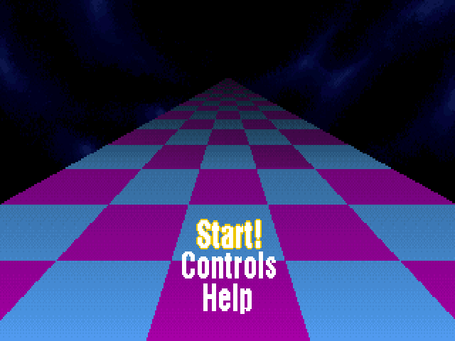 | 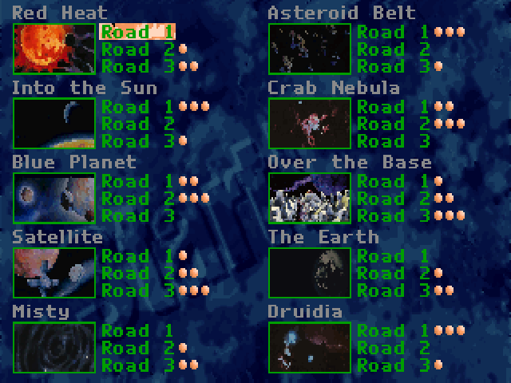 |
| Main menu | Road select — 30 roads across 10 worlds |
| 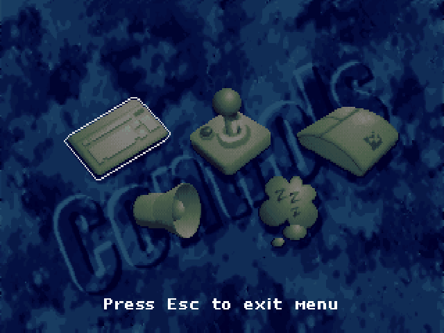 | 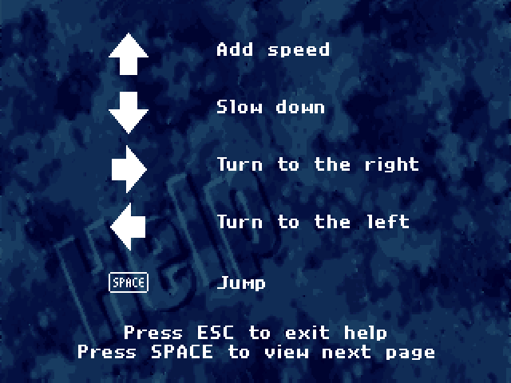 |
| Settings — the active device and sound state outlined in orange | Help |
| 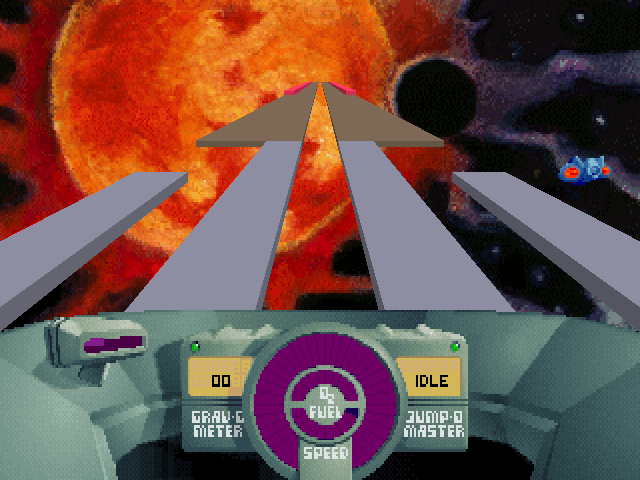 | 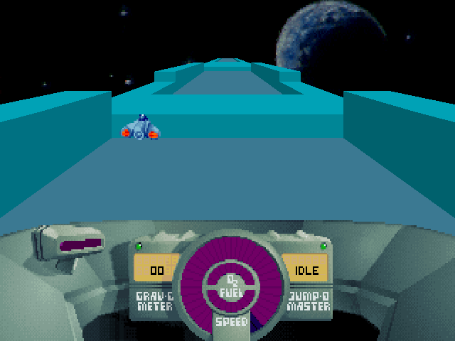 |
| Road 1 | Road 5 |
| 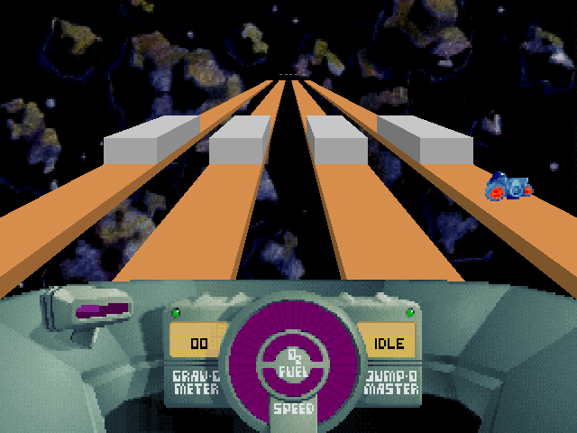 | 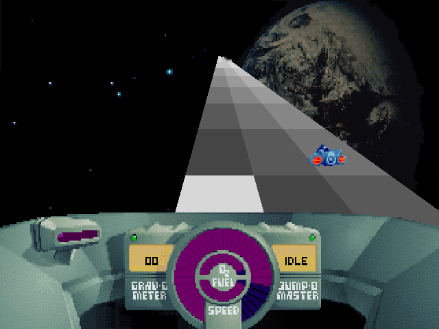 |
| Road 16 | Road 26 |

The boot intro runs the original's whole sequence — title, animation, the
logo wiped in over 18 frames, and five credit plates cross-faded through their
own palette pairs. Any key skips it; sitting through all thirty-three seconds
of it starts the 1993 attract demo instead, which is the only way the original
ever reaches it.

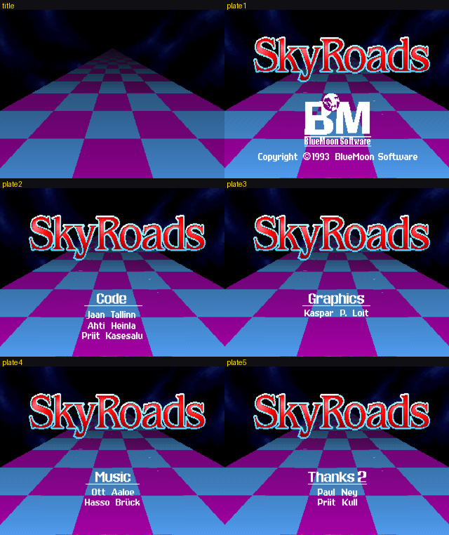

---

## Running it

You need Godot 4.4 or newer (developed against 4.7) and the retail SkyRoads
data — see [Game data](#game-data) below.

```sh
godot --path .                            # intro, menu, play
godot --path . -- --road 7                # straight into road 7
godot --headless --path . -- --replay 1   # replay road 1's solved route
```

**Controls** follow the original, including its four diagonal keys — one key
meaning "steer *and* throttle", because many keyboards cannot report three
simultaneous presses:

| | |
|---|---|
| Arrows | steer, throttle, brake |
| `Q` `E` `Z` `X` (or Home/PgUp/End/PgDn) | the diagonals |
| Space | jump |
| `P` | pause |
| `L` / `C` | object IDs / collision overlay |
| `F2` or `R` | dump a replayable recording of this run |

Joystick and mouse are selectable on the settings screen, as in the original,
which also marks the setting currently in force in orange.

---

## On a phone

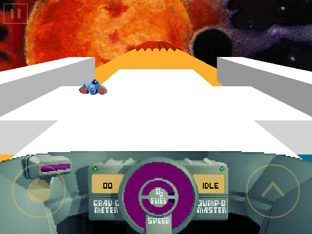

Android and iOS presets are in `export_presets.cfg`; both need the matching
export templates installed, and Android additionally needs the build template
(Project → Install Android Build Template) because Play wants an AAB.

A touch build differs from a desktop one in six places, all of them shell,
none of them simulation. `SkyRoads.is_mobile()` gates them, and it is Android
and iOS specifically — not `OS.has_feature("mobile")`, which is also true of a
web export on a touch device:

- **A thumbstick and a jump button** (`scripts/TouchControls.gd`). The drawn
  circles are a hint; the hit areas are the whole left and right halves of the
  screen, and the stick's origin follows the thumb that starts it. Both feed
  `PlayerInput.from_axes` — the same function the joystick and mouse devices
  use — so the simulation is handed the same three values it always was.
- **A pause box, top LEFT**, the farthest point on the screen from the jump
  button so it cannot fire mid-jump. It opens **RESUME / RESTART / QUIT** over
  a dimmed frame — the original's `P` and its "ESC while paused", plus the
  restart a phone has no other way to ask for.
- **An X in the top right of the main menu and the road select.** A phone has
  no Esc, and those are the two screens Esc would leave. Both raise
  `Key.ESCAPE` rather than adding a second way to navigate, so the main menu
  quits the app and the road select goes back — exactly what the model already
  does with that key.
- **No keyboard wording.** The retail menus say "Press Esc to exit menu" and
  "Press SPACE to view next page", painted into the 320x200 pictures. On mobile
  those lines are covered with background taken from the SAME ROW's left margin
  — the wording is centred, so the margin is always background and the row
  keeps its own lighting — and the port writes "TAP OUTSIDE TO GO BACK" and
  "TAP TO TURN THE PAGE" in the game's own 8x8 font. One derived texture in
  memory; no art file is modified and nothing is forked.
- **Taps navigate the menus.** Each hot region is an overlay pict's own
  rectangle out of `gfx.json`, so the layout is the original's rather than
  invented. On the road list a tap selects and a second tap on the same road
  starts it — thirty small cells and an instant launch is a bad pairing.
- **The settings screen hides the control row.** Keyboard/joystick/mouse are
  dimmed and unreachable: the device is the touchscreen, and nothing on that
  row could change it. The sound setting is untouched. `PlayerInput.TOUCH` is
  chosen by the platform and never written to `skyroads.cfg`, which stays
  byte-compatible with a DOS save.

The screen stays letterboxed at 4:3 (`stretch/aspect="keep"`). "Expand" would
show more of the world than DOS did and quietly invalidate every parity
measurement in `docs/BUGS.md` on the one platform nobody is measuring.

**The letterbox is large, and it cannot be painted.** `scale_mode` is integer,
so the picture takes the largest whole multiple that fits: on a 2992x1344
screen that is 5x — 1600x1200 at offset (696, 72), because 6x would need 1440
rows. That leaves 696px of black either side. Filling it needs `aspect=expand`
plus the game rendered into a fixed 320x240 `SubViewport`, which moves both
what `Main._capture_*` photographs and the transform `touch_shell.gd` maps taps
through. See the end of `docs/BUGS.md` §12 — it is a mobile-phase job, not a
tweak.

That 5x offset is also the number to compute tap coordinates from when driving
a device over `adb`. Getting it wrong looks exactly like a broken button.

To see the touch layout without a phone:

```sh
godot --path . -- --touch --road 2      # mouse drives the on-screen stick
```

---

## Game data

This repository contains **no retail game files**. `data/` holds derived
exports — PNG, JSON, Ogg — produced from a copy of the 1993 release by the
analysis toolkit that lives alongside this project.

SkyRoads was released as freeware by Bluemoon Interactive and is still
distributed by them. The derived assets here are included so the port is
runnable and reviewable; they remain the work of Bluemoon Interactive, and
nothing in this repository is offered under a licence that could grant rights
to them. The code is the part this project claims.

See [LICENSE](LICENSE): the port's code is MIT, and the file lists exactly
which paths under `data/` are Bluemoon's derived work and therefore outside
that grant.

---

## How it was built

The port is checked against a reference implementation of the DOS engine
rather than against screenshots or memory — and, where that reference turned
out to be wrong, against the retail binary. Four things follow from that.

**The simulation is bit-exact.** A three-way differential runs the same input
through the C reference, a Python model and this GDScript implementation and
compares 24 state fields on every tick — position, velocity, fuel, oxygen,
collision flags, the lot. 60,964 ticks over the shipped levels and 150
randomised trials, with no disagreement — and the Python side is now anchored
to the retail binary rather than to the C reference, so the agreement means
something it did not before.

**The renderer is derived from the original's tables, not fitted by eye.** The
DOS game has no 3D: every scanline of every tile shape is a span list baked
into `TREKDAT.LZS`. Those tables were decoded to recover the projection —
which turned out to be a vertical pinhole *plus* a separate horizontal cone
that no single camera reproduces — and the tunnel arch, the block faces and
the band ordering all come from the same source.

**The reference is checked too.** `docs/BUGS.md` §11 is a pass measured
against the retail `SKYROADS.EXE` itself rather than against the C
reimplementation — disassembled with capstone, with the retail `.LZS` files
decoded alongside. It found **eleven** defects the C reference shares, so no
existing test could see them: a main menu with no SkyRoads logo, a settings
screen that never showed which setting was active, an intro that stopped
twenty-three seconds early, the wrong menu music, a third help page the
original never displays, a post-game screen that waited for a key it should
not, fades the player could not skip, a road-select cursor that refused two
moves the original makes, a confirm key the original does not accept, and an
attract demo triggered from the wrong place entirely — the retail menus block
on `int 21h ah=7` and cannot time out, so the demo comes off the end of an
unskipped intro and loops back into it. All eleven are fixed, and three of
them had been written down as "authentic" on the C reference's word.

**Findings are recorded, including the wrong ones.** [`docs/BUGS.md`](docs/BUGS.md)
is the audit trail. Several defects turned out to be misdiagnosed: a reported
"near-row darkening" did not exist (the reference paints one colour at every
distance — the real fault was two swapped block faces), and "chunky blue stars"
were not stars at all but the sky's black rendering as a texture-importer
artefact. Fixes that were tried and *measured worse* are written down too, so
nobody repeats them.

---

## Tests

```sh
./verify.sh                    # 484 checks, 77 green lines
THREEWAY=1 ./verify.sh         # + C vs Python vs GDScript on real levels
```

`verify.sh` runs three passes, because a suite run alone lies in two
documented ways: a syntax error in an unreferenced file ships green, and a
suite that dies before asserting prints no failures. Every suite must print a
positive `Result:` line.

| suite | covers |
|---|---|
| `test_physics` | the simulation against golden traces |
| `test_menu` | shell navigation, diffed step-by-step against the C engine |
| `test_hud` | every dashboard readout, at its boundaries |
| `test_audio` | music and sfx assets, loop points, song sequence |
| `test_input` | keyboard, joystick, mouse and touch mapping |
| `test_occlusion` | what hides the ship — including inside a tunnel |
| `render_menu`, `render_dashboard`, `render_backdrop` | pixels, against frames the reference engine drew |
| `test_geometry`, `test_data`, `test_timing`, `test_launch_options` | mesh, level data, fixed-step loop, CLI |
| `test_touch` | the on-screen stick: screen halves, floating origin, two thumbs at once |
| `touch_shell` | a synthetic tap through the real input pipeline into the real scene |
| `test_intro` | the intro's phases, durations and palette pairs, stepped tick by tick |

The pixel suites compare against **golden frames produced by the reference
engine**, not against this port's own past output — so drift is measured
against the original, not against yesterday. Where the reference itself was
found to be missing something, the golden is repaired with the retail art
rather than with the port's output: the settings screens have the original's
orange state overlays composited in from `SETMENU.LZS` before the diff, so
the comparison is still against 1993 and not against ourselves.

New suites in this project are mutation-tested: the code is deliberately
broken, the tests are confirmed to fail, and the break is reverted.

---

## Layout

```
scripts/          the shell, the renderer, the simulation
  model/          pure logic, no scene tree: MenuModel, HudModel, PlayerInput
  app/            LaunchOptions (the command line)
data/             derived assets + the recovered camera and tables
  branding/       app icons, generated from the game's own art
tests/            suites, fixtures, and golden frames from the reference
docs/parity/      before/after evidence for each fidelity fix
```

`scripts/SkyRoadsPlay.gd` is the simulation and is proven bit-exact — it is
not edited without a failing three-way trace to justify it.

The analysis toolkit that produced everything under `data/` — the exporters,
the route solver, the disassembly and the C reference the port is measured
against — lives outside this repository, alongside it. `docs/BUGS.md` cites it
throughout; the paths it names are relative to that wider tree, not to this
one.

---

## Credits

**SkyRoads** is by **Bluemoon Interactive** (Jaan Tallinn, Marko Kaasik,
Ivar Annamaa), 1993. This is an unofficial port. All game design, artwork and
music are theirs.

**Godot port, 2026 — Carlos Piñan.** The game credits it after the original's
five plates, on the same timing, rather than over the main menu.

There is no store release: this repository is the deliverable. The package name
`com.cpinan.skyroads` and the absent keystore and iOS team id are all fine as
they are, and nothing here should be spent on store assets or signing.

---

## References

Everything this port was measured against, so that any claim in
[`docs/BUGS.md`](docs/BUGS.md) can be re-checked from scratch.

**The game.** SkyRoads, Bluemoon Interactive, 1993. Released as freeware by
its authors and still distributed by them at
[bluemoon.ee](http://www.bluemoon.ee/history/skyroads/) — over HTTP; the HTTPS
host does not serve it. No retail file is included in this repository.

**The measuring instrument.** `SKYROADS.EXE` from that release,
sha256 `c3a55223e359749555535e138ef4219bc94458639e44f70edf3cfcb2f28c26ac`.
Where this project says "read off the binary" it means that file, disassembled
with [Capstone](https://www.capstone-engine.org/) in 16-bit mode: the code
image starts at `hdrpar * 16` (the u16 at EXE offset 8), addresses are
code-segment relative, and the data segment is paragraph `0x66E`. Every EXE
address cited in the docs is reproducible from those four facts.

**The C reference.** `skyroads-port/`, a reimplementation of the DOS engine by
Ammaar Reshi (MIT), which sits outside this repository and was used as a
differential oracle rather than as source. It is wrong in fifteen places that
are now known; each is written up in
[`docs/reference-corrections/`](docs/reference-corrections/) with the EXE
address that settles it. It bundles Nuked-OPL3 by Alexey Khokholov
(LGPL-2.1) for the FM synthesis.

**The engine.** [Godot](https://godotengine.org/) 4.7.1 (MIT), using the
`gl_compatibility` renderer on every platform — including mobile, which Godot
would otherwise put on a different pipeline than the one every measurement in
`docs/` was taken on.

**The analysis toolkit.** `analysis/`, also outside this repository: the Python
model of the simulation, the level and asset decoders, the route solver, and
the three-way differential harness. `tools/` holds the C-side instruments —
`replay_frames.c` for reference frames and surface maps, `dump_bands.c` for the
baked span tables, and the Python comparators `frame_compare.py`,
`sid_compare.py` and `make_compare.py`.
